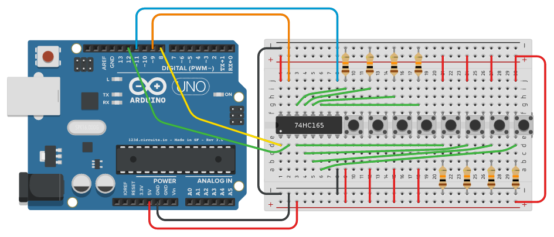
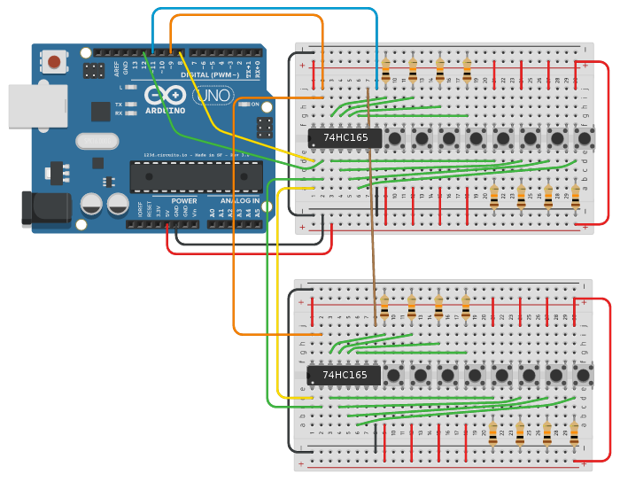

# ArduinoShiftIn
This is a small library for reading in values from a 74HC165 8 bit shift register.

The Arduino has only a limited amount of pins, therefore it might happen that you run out of pins.
For this case, the 74HC165 comes to the rescue. It is an 8 bit shift register. It allows you to read in 8 values by only using 4 pins on your Arduino. Furthermore you can daisy-chain several shift registers by still only using 4 Arduino Pins.

## Easy install (zip import)
The easiest way to install this library is by downloading the newest release and then importing it.
You don't have to unzip it. Just open your Arduino IDE and navigate to *Sketch* > *Include Library* > *Add .ZIP* and then select the zip file.

## Manual install
Of course you can also install this library manually. To do so, download the newest release and unzip it. Then you have to copy the `ShiftIn` folder (NOT the `ShiftIn-x.y.z` folder) and copy it to your Arduino library folder:
* Windows: `My Documents\Arduino\libraries\`
* Mac and Linux: `Documents/Arduino/libraries/`

After that you just have to restart your Arduino IDE.

## Usage
If you have installed this library, you can include it by navigating to *Sketch* > *Include Library* > *ShiftIn*. This will add the line `#include <ShiftIn.h>` to your sketch (of course you could also write this line manually).

Now you can actually use this library:
``` c++
#include <ShiftIn.h>

// Init ShiftIn instance with one chip.
// The number in brackets defines the number of daisy-chained 74HC165 chips
// So if you are using two chips, you would write: ShiftIn<2> shift;
ShiftIn<1> shift;

void setup() {
  Serial.begin(9600);
  // declare pins: pLoadPin, clockEnablePin, dataPin, clockPin
  shift.begin(8, 9, 11, 12);
}

void displayValues() {
  for(int i = 0; i < shift.getDataWidth(); i++)
    Serial.print( shift.state(i) ); // get state of button i
  Serial.println();
}

void loop() {
  if(shift.update()) // read in all values. returns true if any button has changed
    displayValues();
  delay(1);
}
```


If you want to use two shift registers, you only have to change the declaration from `ShiftIn<1> shift;` to `ShiftIn<2> shift;`. The layout can look like this;


# API
Depending on the number of chips, this library will use different data types.
If you are only using one chip, the type `ShiftType` will be an `unsigned byte` (`uint8_t`). For two chips it will be an `unsigned int` (`uint16_t`). For three and four chips it will be an `unsigned long` (`uint32_t`) and for 5 to 8 chips it will be an `unsigned long long` (`uint64_t`). More than eight chips are not supported yet.

This function must be called in the `setup` function. It is used to tell the library the pins it should use.
``` c++
void begin(int ploadPin, int clockEnablePin, int dataPin, int clockPin)
```

Gets/sets the delay time for the clock pin (in microseconds). This value defaults to 5 and in most cases there's no need to change it.
``` c++
uint8_t getPulseWidth()
void setPulseWidth(uint8_t value)
```

Returns the number of buttons (bits in the state)
``` c++
uint16_t getDataWidth()
```

Returns true if any button has changed its state during the last frame.
``` c++
boolean hasChanged()
boolean hasChanged(int i) // same as above, but only for button i
```

Returns the complete state for this frame / last frame
``` c++
ShiftType getCurrent()
ShiftType getLast()
```

Returns the state of a single button for this frame / last frame
``` c++
boolean state(int i)
boolean last(int i)
```

Whether button i is just pressed/released
``` c++
boolean pressed(int id) // wasn't pressed lasst frame, but is pressed now
boolean released(int id) // was pressed last frame, but is released now
```

This function (or the update function) should be called each frame exactly once. It will read in all values from the shift registers and it will return the new state.
``` c++
ShiftType read()
```

This function is basically the same as the read function, but it will return `true` if some button has changed its state and `false` otherwise
``` c++
boolean update()
```
